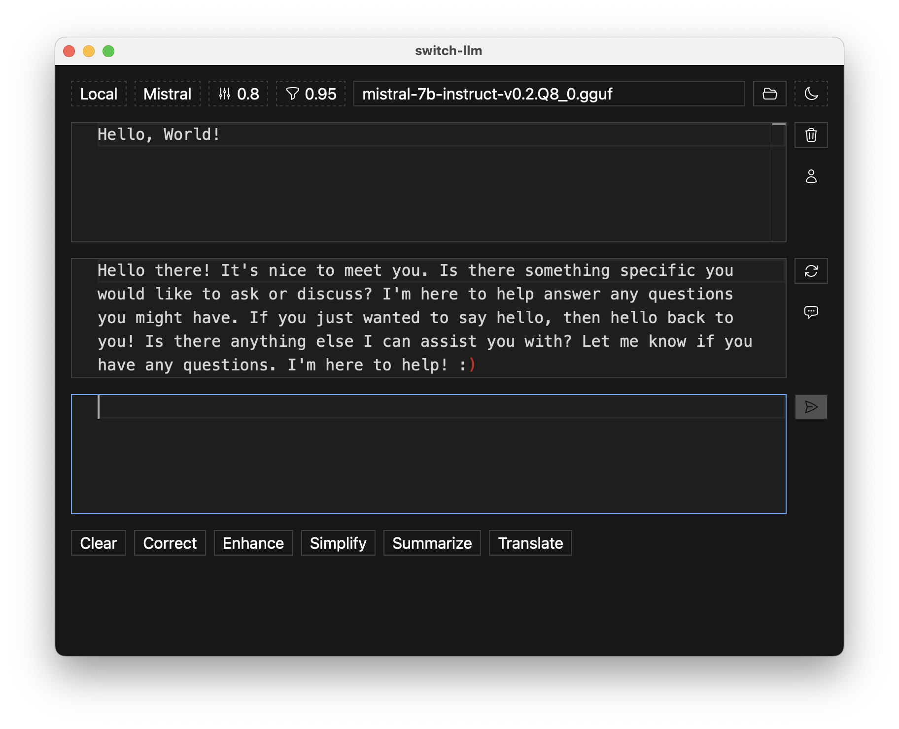

# Switch LLM

> A macOS application to run local models like Mistral, with the option to enhance conversations by
> switching to GPT-4.



## Prerequisites

- macOS 14 (ARM)
- Node.js 20+
- Zig 0.12.0 (master)

## Getting started

Install npm dependencies:

```sh
npm install
```

Build the app:

```sh
npm run build
```

Start the app:

```sh
npm start
```

Download a model file in [GGUF](https://github.com/ggerganov/ggml/blob/master/docs/gguf.md) format
from Hugging Face:

```sh
curl -L -o mistral-7b-instruct-v0.2.Q8_0.gguf https://huggingface.co/TheBloke/Mistral-7B-Instruct-v0.2-GGUF/resolve/main/mistral-7b-instruct-v0.2.Q8_0.gguf
```
